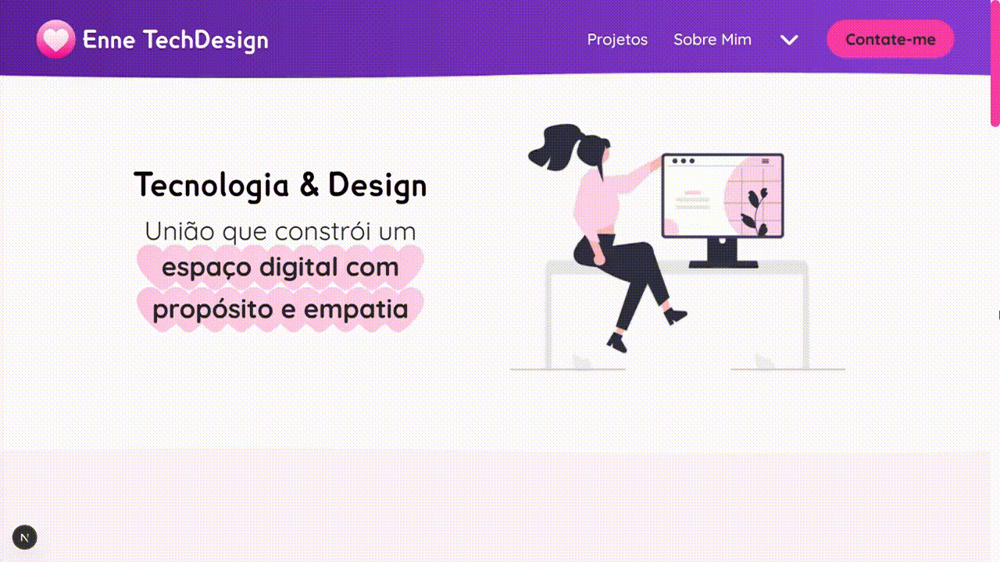

# Enne TechDesign

 Portfólio web sobre mim e meus trabalhos enquanto UI/UX Designer e Desenvolvedore Front-End


## 🌐 Aplicação Hospedada

 [Clique aqui para acessar o website](https://ennetechdesign.vercel.app)


## 🎞️ Pré-visualização

 


## ⚡ Funcionalidades

 - Menu de navegação mobile abrível e fechável
 - Barra horizontal de navegação por dentro da página para desktop englobando uma opção de abrir uma lista de opções restantes
 - Detecção de tema de cores preferencial da pessoa usuária e adaptação da tela conforme sua preferência
 - Opções de escolher tema de cores entre escuro e claro
 - Integração com formulário personalizado feito no TypeForm
 - Mais acessibilidade usando a tecla "tab"
 - Efeitos de "hover" e de "active" nos elementos  clicáveis


## 🚀 Tecnologias Utilizadas

 <p align="left">
   
   
   
   
   
   
   
   
   
   
   
   
 </p>


## 📂 Estrutura do Projeto

 ```plaintext
 enne-techdesign/
 ├── .next/
 ├── docs/                   # Arquivos de documentação do projeto
 │   ├── credits.txt
 │   ├── screen-prototypes/ 
 │   ├── preview.mp4
 │   ├── style-guide.jpg
 ├── node_modules/           # Dependências do projeto
 ├── public/                 # Arquivos estáticos
 │   ├── assets/                # Imagens utilizadas
 │   ├── favicon/               # Logo do site
 ├── src/                    # Código de fonte da aplicação
 │   ├── app/                   # Estrutura principal de rotas e renderização
 │   ├── components/            # Componentes reutilizáveis (ex: header, footer)
 │   ├── data/                  # Dados utilizados como banco local (TS, arrays)
 │   ├── fonts/                 # Fontes de texto customizadas e sua configuração
 │   ├── lib/                   # Funções utilitárias e helpers compartilhados (ex: cn, formatações, validações)
 │   ├── providers/             # Provedores de contexto global (ex: ThemeProvider para controle de tema)
 │   ├── types/                 # Definições de tipos e interfaces TypeScript para tipagem dos dados
 ├── .gitignore
 ├── eslint.config.mjs
 ├── LICENSE                 # Arquivo de licença do projeto
 ├── next-env.d.ts
 ├── next.config.ts
 ├── package-lock.json
 ├── package.json
 ├── postcss.config.mjs
 ├── README.md
 ├── tsconfig.json
 ```


## 🛠️ Instalação Local

 1. **Clone o repositório**
 
 No terminal, rode o seguinte comando:
 
 ```bash
 git clone https://github.com/Enne-Amore/enne-techdesign.git
 ```
 
 2. **Entre no diretório do projeto:**
 
 Navegue até o diretório do projeto clonado:
 
 ```bash
 cd enne-techdesign
 ```
 
 3. **Instale as dependências:**
 
 Para instalar as dependências do projeto, execute:
 
 ```bash
 npm install
 ```
 4. **Inicie o servidor de desenvolvimento:**
 
 Para iniciar o servidor de desenvolvimento, execute:

 ```bash
 npm run dev
 ```
 
 Abra o seu navegador e acesse http://localhost:3000 para visualizar o projeto em execução.


## 🌈 Cores

 | Cor               | Hexadecimal |
 | ----------------- | ----------- |
 | Roxa Clara        | `#863DD4`   |
 | Roxa Escura       | `#5E239D`   |
 | Rosa Clara 1      | `#FFD1E9`   |
 | Rosa Clara 2      | `#FFC2E2`   |
 | Rosa Escura 1     | `#FB3CA5`   |
 | Rosa Escura 2     | `#F229AC`   |
 | Branca            | `#FFFCFE`   |
 | Branca Arrosada 1 | `#FFFAFD`   |
 | Branca Arrosada 2 | `#FFF0F8`   |
 | Cinza             | `#282426`   |
 | Preta             | `#11000A`   |


## 🔤 Fontes Tipográficas

 - **Quicksand**  
   Exemplo de uso:  
   `font-family: var(--font-quicksand);` ou `font-quicksand`
 - **Geometos Rounded**  
   Exemplo de uso:  
   `font-family: "geometos-rounded";` ou `font-geometos-rounded`
 - **Nunito**  
   Exemplo de uso:  
   `font-family: "nunito";` ou `font-nunito`
 - **Bitter**  
   Exemplo de uso:  
   `font-family: "bitter";` ou `font-bitter`


## 🌟 Referências de Uso

 - [Fonte da logo do site - Flaticon](https://www.flaticon.com/br/icones-gratis/coracao)
 - [Ícones utilizados - Font Awesome](https://react-icons.github.io/react-icons/icons/fa6)
 - [Fonte de texto Lexia Readable - Dafont](https://www.dafont.com/pt/lexia-readable.font)
 - [Fonte de texto Quicksand - Google Fonts](https://fonts.google.com/specimen/Quicksand)
 - [Fonte de texto Geometos Rounded - Dafont](https://www.dafont.com/pt/geometos-rounded.font)
 - [Fonte de texto Nunito - Google Fonts](https://fonts.google.com/specimen/Nunito)
 - [Fonte de texto Bitter - Google Fonts](https://fonts.google.com/specimen/Bitter)
 - [Imagem ilustrativa do hero - Undraw](https://undraw.co/illustrations)


## 🔧 Suporte

 Para me contatar como suporte, o meu email é [Enne.Pessoa@gmail.com](mailto:Enne.Pessoa@gmail.com)

